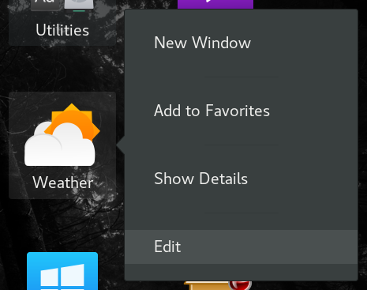

# Desktop Editor (GNOME Extension)
Edit .desktop files from GNOME Shell!

# Configuration
I'm too lazy to write the gui for now. You can edit 'editor' on
`$HOME/.local/share/gnome-shell/extensions/desktop-editor@naheel.com/extension.js` and restart shell. Default is `beesu gedit`
